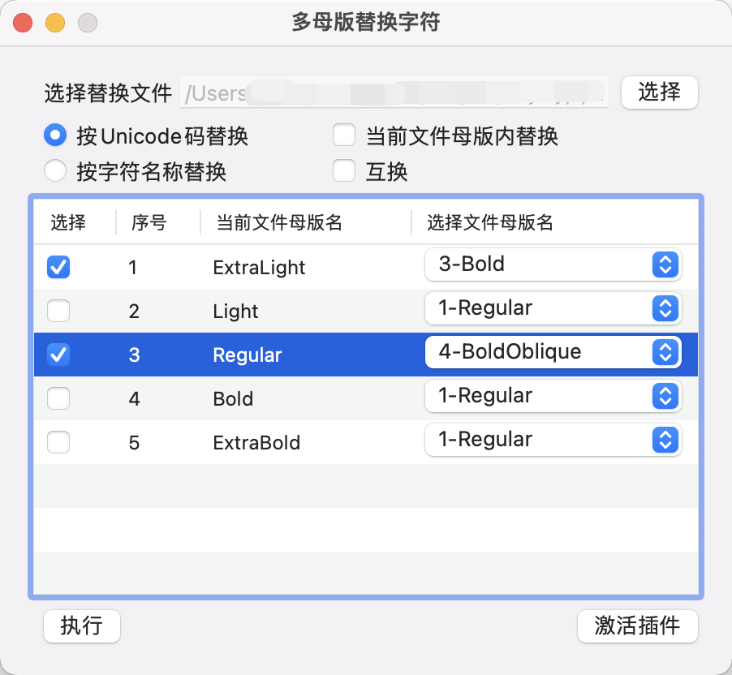

# RTMastersReplaceGlyphs

#### 介绍
Glyphs3 插件，用于多母版的字符替换。

#### 使用说明

使用：安装后，菜单栏【编辑】中点击【RT多母版替换字符】打开。

如图所示： 打开插件后，列表中列出当前文件的所有母版。

序号表示当前文件中母版的顺序。 

可以选择其他文件，选择后[选择文件母版名]列会加载选择的的文件中的所有母版集合的"序号+母版名" 。

如果选择[当前文件母版内替换]，[选择文件母版名]列会加载当前母版的"序号+母版名" ​集合。

步骤： 

1、选择好要替换的字符。

2、选择glyphs文件，或者选择[当前文件母版内替换]。

3、选择要替换的母版层，在要替换的母版前的[选择]框打上勾。

4、在[选择文件母版名]处选择被替换成的母版。 

5、其他设置选择好，点执行 。

执行结果：当前文件的选择的母版中的所选字符，会被选择的文件中的[选择文件母版名]中所选择的母版中的字符替换。如果选[互换]，两个选择的字符会相互调换。

再通俗一遍讲逻辑：前面的选择框是选择当前文件中要被替换的母版，后面下拉框选择替换成哪个母版。

后面下拉框的母版集合是你选择的文件中的母版，如果选择了[当前文件母版内替换]，下拉框就是当前文件的母版集合。

